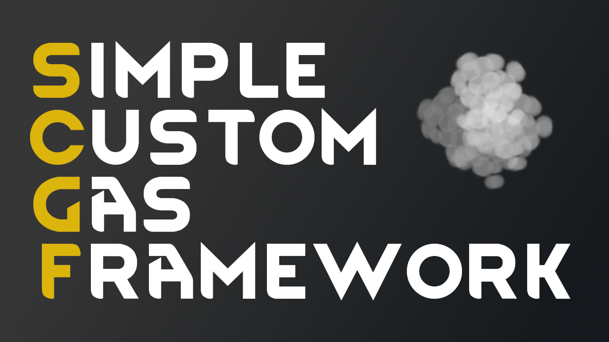

# Simple Custom Gas Framework

RimWorld modding framework for adding custom gases.

Find it [here](https://steamcommunity.com/sharedfiles/filedetails/?id=2999444522) on the Steam workshop.

Check out the [wiki](https://github.com/NachoToast/SimpleCustomGasFramework/wiki) to learn more.

See also:

- [Knockout gas](https://github.com/NachoToast/RimWorldKnockoutGas)
- [Tear gas](https://github.com/NachoToast/RimWorldTearGas)
- [Gas vents](https://github.com/NachoToast/RimWorldGasVents)

